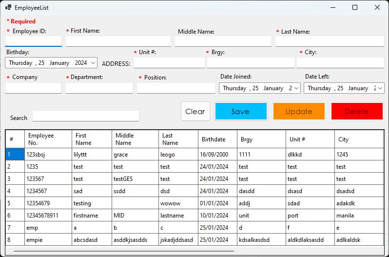
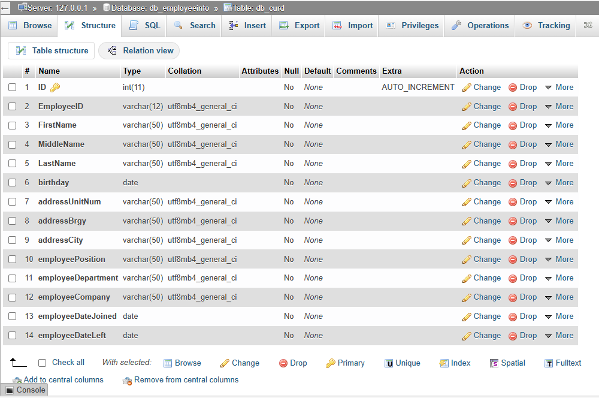

# Making a CRUD with C# .NET Winforms User Interface

## Table of contents
 
- [Overview](#overview)
  - [Data](#data) 
  - [Nested Folder](#nested-folder) 
  - [Screenshot](#screenshot)
  - [CREATE](#links)
  - [READ](#READ)
  - [UPDATE](#update)
  - [DELETE](#delete)
  - [Data Validation](#data-validation)
- [My process](#my-process)
  - [What I learned](#what-i-learned)
  - [Continued development](#continued-development)
  - [Useful resources](#useful-resources)

## Overview

A CRUD made of  of a C# .Net Forms.

[Video Demo]

### Data
** Data with * are mandatory. Numbers inside () are Maximum Length accepted. 

- Data Variables 
 - EmployeeID* (11)
 - FirstName* (50)
 - MiddleName (50)
 - LastName* (50)
 - birthday 
 - addressUnitNum* (50)
 - addressBrgy* (50)
 - addressCity* (50)
 - employeePosition* (50)
 - employeeDepartment* (50)
 - employeeCompany* (50)
 - employeeDateJoined 
 - employeeDateLeft

### Nested Folder
- EmployeeList
- README.md
- Images
- Form1.cs
- Form1.Designer
- Form1.resx
  - [isDataValid.cs](/isDataValid.cs)
  - dbconnection.cs
  - [queries.cs](/queries.cs)


### Screenshot

A screenshot of the user interface when ran. 


A screenshot of the connected database from MySQL

## My process

### Create

- add input data to database
```   db_connect.Open();
                    cmd = new MySqlCommand(query.insertQuery(), db_connect);
                    cmd.Parameters.Clear();

                    SAVETODATABASE();

                    if (i > 0)
                    {

                        MessageBox.Show("Record Save Success!", "Employee Record", MessageBoxButtons.OK, MessageBoxIcon.Information);
                    }
                    else
                    {
                        MessageBox.Show("Record Save Failed!", "Employee Record", MessageBoxButtons.OK, MessageBoxIcon.Exclamation);
                    }

                    db_connect.Close();
                    LoadRecord();
                    clearForm();
```


### Read

```
 //Loads the data from database mySql.
         private void LoadRecord()
        {   try
            {
                db_connect.Open();
                employeeRecordTable.Rows.Clear();
                cmd = new MySqlCommand(query.selectQuery(), db_connect);

                dataRead = cmd.ExecuteReader();
                DATAREAD();

                dataRead.Close();
                db_connect.Close();
            }
            catch (InvalidOperationException ex)
            {
                MessageBox.Show("Warning: " + ex.Message, "Employee Record", MessageBoxButtons.OK, MessageBoxIcon.Warning);
            }
        }
```

### Update 

** Restriction: EmployeeID cannot change.

```//cannot edit EmployeeID
                db_connect.Open();
                cmd = new MySqlCommand(query.updateQuery(), db_connect);
                SAVETODATABASE();

                if (i > 0)
                {
                    MessageBox.Show("Record Update Success!", "Employee Record", MessageBoxButtons.OK, MessageBoxIcon.Information);
                }
                else
                {
                    MessageBox.Show("Record Update Failed!", "Employee Record", MessageBoxButtons.OK, MessageBoxIcon.Exclamation);
                }

                db_connect.Close();
                LoadRecord();
                clearForm();
```

### Delete 

```
            db_connect.Open();
            cmd = new MySqlCommand(query.deleteQuery(), db_connect);


            cmd.Parameters.Clear();

            cmd.Parameters.AddWithValue("@EmployeeID", EmployeeIDText.Text); //EmployeeIDText - input

            i = cmd.ExecuteNonQuery(); // execute mysqlcommand. checks if 'Column count match value count at row 1'

            if (i > 0)
            {
                MessageBox.Show("Record Delete Success!", "Employee Record", MessageBoxButtons.OK, MessageBoxIcon.Information);
            }
            else
            {
                MessageBox.Show("Record Delete Failed!", "Employee Record", MessageBoxButtons.OK, MessageBoxIcon.Exclamation);
            }

            db_connect.Close();
            LoadRecord();
            clearForm();
```

### Data Validation

- Mandatory Input the required data from the forms
- Won't save if empty is string
- Doesn't accepts more than 50 characters
- Doesn't accept duplicate EmployeeID (unique and 11 characters)

### What I learned

- Classes
- C# (I am fairly new to c# but I am still learning)
- More OOP

### Continued development

- :bulb: Exception Handling
- :bulb: Make it into a list or a dictionary(key:value)
- :bulb: try to use LINQ
- :bulb: fix interface

### Useful resources
- [EverSQL SQL Query Syntax Check & Validator](https://www.eversql.com/sql-syntax-check-validator/)
- [SDPT Solutions Basic C# Playlist | Tagalog | Youtube Playlist](https://youtube.com/playlist?list=PLVnJhHoKgEmr_K2Gn9WWZI4ulrkEUll_s&si=6w0KY1L1NEfSpbAd)
- [Handling Exceptions in C# - When to catch them, where to catch them, and how to catch them | IAmTimCorey](https://www.youtube.com/watch?v=LSkbnpjCEkk&t=1432s)
- [How to Use a Debugger - Debugger Tutorial | Tech With Tim](https://www.youtube.com/watch?v=7qZBwhSlfOo)